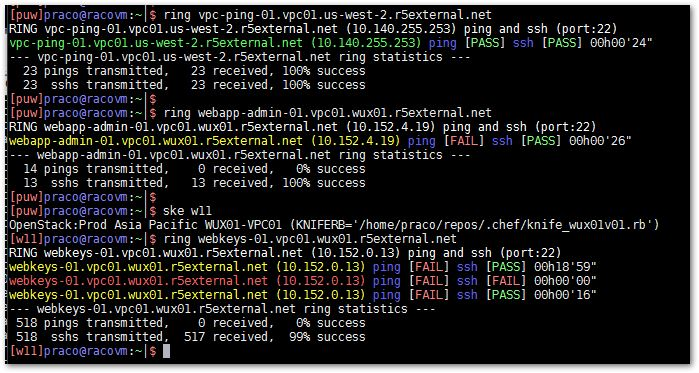

# ring
Similar to `ping` with the addition of `nc` to test for `nc` availability

## Description
Bash script that checks to see:
* if a host is ping-able, and
* if (using `nc`) a port (default ssh:22) on a server is listening (so that you can `ssh` to it or anything else)

Usefule for if/when a server is being rebooted or built to know if/when it can be `ssh`ed in to (again).

## Usage
ring.sh DESTINATION [PORT]

DESTINATION can be an IP address or a host name that should be resolvable (via DNS)

Hit [Ctrl-C] to quit

## Output
The output resembles that of a typical linux/unix `ping` output

## License
Not licensed - knock yourself out!
